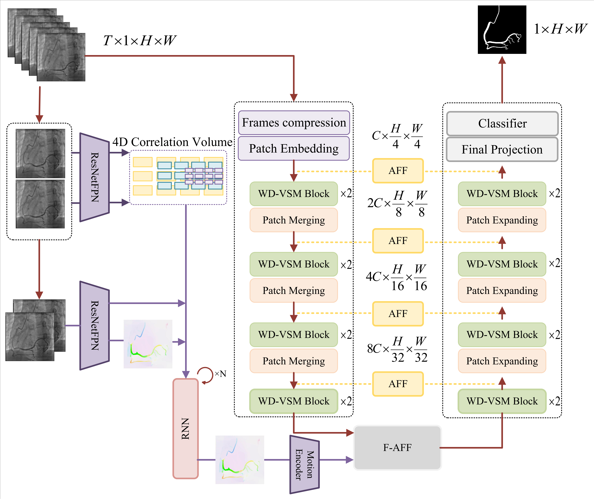

# FlowVM-Net

This is the official code repository for "FlowVM-Net: Enhanced Vessel Segmentation in X-Ray Coronary Angiography Using Temporal Information Fusion", which is accpeted by **Journal of Imaging Informatics in Medicine** as a original paper!

## Framework Overview


*Figure 1: The overall architecture of FlowVM-Net combining spatial features with temporal information*

## 0. Environments.
```bash
conda create -n flowvmnet python=3.8
conda activate flowvmnet
pip install torch==1.13.0 torchvision==0.14.0 torchaudio==0.13.0 
pip install packaging
pip install timm==0.4.12
pip install pytest chardet yacs termcolor
pip install submitit tensorboardX
pip install triton==2.0.0
pip install causal_conv1d==1.0.0  # causal_conv1d-1.0.0+cu118torch1.13cxx11abiFALSE-cp38-cp38-linux_x86_64.whl
pip install mamba_ssm==1.0.1  # mmamba_ssm-1.0.1+cu118torch1.13cxx11abiFALSE-cp38-cp38-linux_x86_64.whl
pip install scikit-learn matplotlib thop h5py SimpleITK scikit-image medpy yacs opencv-python
```
The .whl files of mamba_ssm could be found [here](https://github.com/state-spaces/mamba/releases).
The .whl files of causal_conv1d could be found [here](https://github.com/Dao-AILab/causal-conv1d/releases).

## 1. Prepare the dataset.

Data Format

```
├── './data/your_dataset/'
    ├── train
        ├── images
            ├── 001.png
            ├── 002.png
            └── ... # {id}.png 
        ├── masks
            ├── 001.png
            ├── 002.png
            └── ... # {id}.png 
    ├── val
        ├── images
            ├── 001.png
            ├── 002.png
            └── ... # {id}.png 
        ├── masks
            ├── 001.png
            ├── 002.png
            └── ... # {id}.png 
    ├── test
        ├── images
            ├── 001.png
            ├── 002.png
            └── ... # {id}.png 
        ├── masks
            ├── 001.png
            ├── 002.png
            └── ... # {id}.png 
```

## 2. Train the FlowVM-Net.
- The weights of the pre-trained VMamba could be downloaded [here](https://drive.usercontent.google.com/download?id=1uUPsr7XeqayCxlspqBHbg5zIWx0JYtSX&export=download&authuser=0&confirm=t&uuid=8f3d1bcd-cd88-4ca1-a758-7049c1ebc144&at=AN_67v29VPGaI2TjZsEPsB3Z7y3h%3A1727950609222).
- The weights of the pre-trained Optical Flow model could be downloaded [here](https://drive.google.com/drive/folders/1YLovlvUW94vciWvTyLf-p3uWscbOQRWW).
After that, the pre-trained weights should be stored in './pre_trained_weights/'.

```
bash train.sh
```
- After trianing, you could obtain the outputs in `` ./results/``
  
## 3. Test the FlowVM-Net.
First, in the testing.py file, you should change the address of the checkpoint in 'checkpoint path'.
```
python testing.py
```
